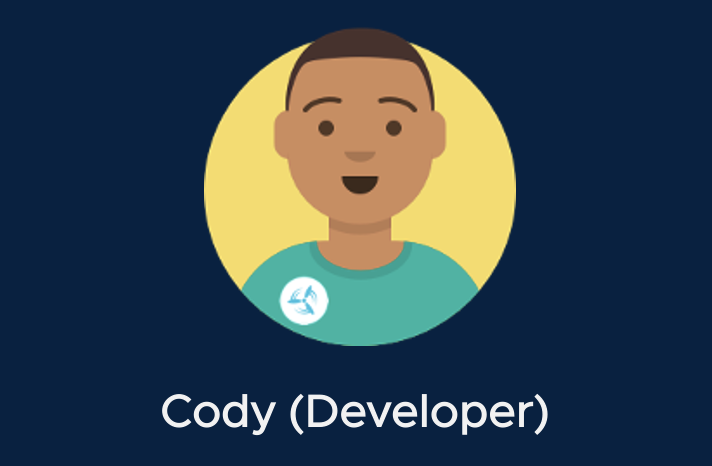

We're going to start our story with Cody, an application developer. His company is now running Tanzu Application Platform, and Cody wants to start using the platform to deliver containerized applications.



If you want to see what Cody's first step is in using Tanzu Application Platform, well.. you're already doing it! Cody logs into Learning Center, the online workshop environment you are using now, to get Day One training on how to be productive in Tanzu Application Platform.

With Learning Center, Cody can get up to speed on his company's best practices and procedures for developing applications. But Cody won't just be reading static content here, and neither will you. Learning Center provides terminal session windows, a fully functioning IDE, and more. In this environment, Cody can explore, experiment, and make mistakes in a live environment without hurting a thing.

It's very easy for Cody's company to author and customize Learning Center workshops to create enablement specific to their enterprise. It's as easy as writing a README for a Git repository.

You'll see a lot more of Learning Center as we progress, but let's get comfortable using the terminal. On one of the terminal windows to the right, type a Linux shell command, or click in the textbox below to have Learning Center execute a command for you.

```execute
kubectl config get-contexts eduk8s
```  

