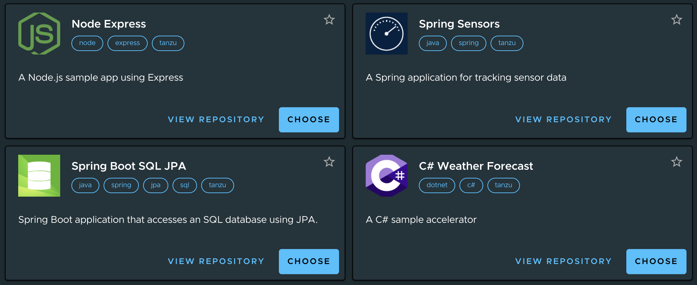
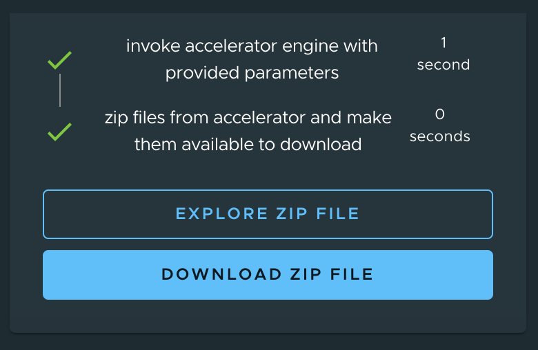

Cody is ready to start developing! He's not a deep expert on container infrastructure, but he's an absolute star in writing business applications using popular languages and frameworks.


Cody wants a project template to get started. He'd like to download a curated template with all the components necessary to edit, build, and run the project. He doesn't want to own the responsibility of writing and maintaining the Dockerfiles, Kubernetes resources, and other infrastructure artifacts. That leaves him with less time to write application logic and deliver stories.

Fortunately, Tanzu Application Platform provides an easy way for Cody to browse and consume templates that have been approved for use by his company. It's called **Application Accelerator**, and its hosted in the web interface for Tanzu Application Platform, also known as TAP GUI. 
* Enterprise Architects use Application Accelerator to provide developers and operators in their organization with enterprise-compliant templates for code and configurations.
* Developers use Application Accelerator to create or access projects which follow enterprise standards.

We're going to check out **Application Accelerator** by clicking on the link below. Be aware that it will open up a new browser tab, so you may need to switch back and forth between that one and this one to follow along in the instructions.

```dashboard:open-url
url: https://tap-gui.{{ ENV_VIEW_CLUSTER_DOMAIN }}/create
```

Now, Cody can discover a template that is appropriate for the programming language (e.g. Java, .NET, Node) and the application type (i.e. Web, message-driven, function) that he wants to work on. He can use the template to start a new project, or he can use the template to migrate a pre-existing application.



Let's work with the Spring Sensors template. Press the choose button in the tile for Spring Sensors. The UI will offer some optional parameters for customizing the project template, you can accept the defaults and hit **Next**. You'll then be prompted to review your choices, and you can press **Generate Accelerator**.

Application Accelerator now creates your project template, and gives you the option of browsing or downloading the template. Let's browse it by clicking "Explore Zip File"



If you drill down into the files in the Explore Project view, you will see that they mostly consist of source code files that Cody would use for a starter application, plus some generated files that will give Tanzu Application Platform additional context for working with the application. We will look closely at those additional files in later sections. But now... let's start coding!
