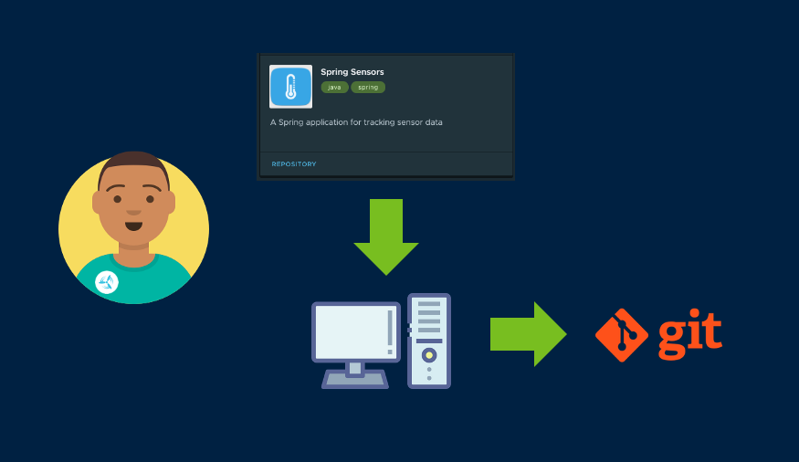

The accelerator contains a template for creating a cloud-native application that is compliant with Alana's enterprise governance standards, and the workload.yaml file for interfacing with Tanzu Application Platform. Cody does not need to provide any other configuration files, such as Dockerfiles or Kubernetes resources, that have dependencies on the target application infrastructure.

The workflow here is that Cody downloads the accelerator template to his local machine, customizes to his needs, and then publishes it to a Git Repo where we can hand off to Alana.



For this demo, we'll use the Tanzu command line interface instead of the Web UI to download the Spring Sensors application accelerator. The Tanzu CLI is your one-stop shop for interacting with the Tanzu Application Platform.

```execute
tanzu accelerator generate spring-sensors --server-url https://accelerator.{{ ingress_domain }} --options='{"gitUrl": {{ ENV_GITREPO }},"gitBranch":main}'
```

Unzip the repo into your local file system:

```execute
unzip -o spring-sensors.zip
```

Commit the configured application to Git, where it can be picked up by Tanzu Application Platform's Supply Chain Choreographer.

```execute
git -C ~/spring-sensors add ~/spring-sensors/
```

```execute
git -C ~/spring-sensors commit -a -m "Initial Commit of Spring Sensors"
```

```execute
git -C ~/spring-sensors push -u origin main
```

Now Cody executes the *workload create* command to publish his new application. 

```execute
tanzu apps workload create spring-sensors -f spring-sensors/tap/workload.yaml -y
```

We'll start streaming the logs that show what Tanzu Application Platform does next:

```execute-2
tanzu apps workload tail spring-sensors --since 1h
```

Let's see where Alana takes it from here!
