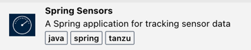

Cody the developer is most productive when he doesn't have to context-switch out of the IDE where he does his development work. That's why Tanzu Application Platform offers integrations with popular IDEs such as Visual Studio Code, Visual Studio, and Jetbrains IntelliJ. Cody can access platform capabilities, including Application Accelerators, without leaving his IDE.

Let's fire up the Accelerator plugin for Cody's IDE to browse accelerators on the left sidebar:

```editor:execute-command
command: tanzu-app-accelerator.sortByNameAsc
```

For this workshop, we'll use the Spring Sensors accelerator. It provides a starter template for a database web app. Select this accelerator:



You'll be prompted for configuration options to customize the template. Accept the defaults and click "Next Step".


Finally, confirm the settings and create a new IDE Project based on the accelerator by selecting "Generate Project":


Once the project is loaded for our new Java webapp, we can take a look at the source code:

```editor:open-file
file: spring-sensors/src/main/java/org/tanzu/demo/DemoController.java
```

With Learning Center, we are using the embedded Coder dev environment that runs in your browser. Of course, you can also code on your local machine using supported IDEs like Visual Studio Code and IntelliJ IDEA. In our app, we see HTTP endpoints defined for generating and displaying sensor data. Give the embdedded Coder a few seconds to complete initialization; in the bottom right blue bar of the embedded Coder editor, you will see Java and a thumbs up symbol when initialization is complete.  Let's use the Developer Tooling in Tanzu Application Platform to run the application.

```editor:open-file
file: spring-sensors/Tiltfile
``` 

Tiltfile was generated by Application Accelerator as part of our project template. If you've never used Tilt before, this script may seem like a lot. Let's kick it off, and then we'll talk through what it's doing. You can right click on the Tiltfile in the code editor, and select `Tanzu: Live Update Start` in the pop-up menu. **Or**, you can click on the command below to accomplish the same thing.

```editor:execute-command
command: tanzu.liveUpdateStart
```

The Tiltfile script is going to deploy our application into our development environment, and it will take about 2.5 minutes to run to completion the first time. But don't worry! It is setting us up to run iterative deployments that will be much, much faster.
