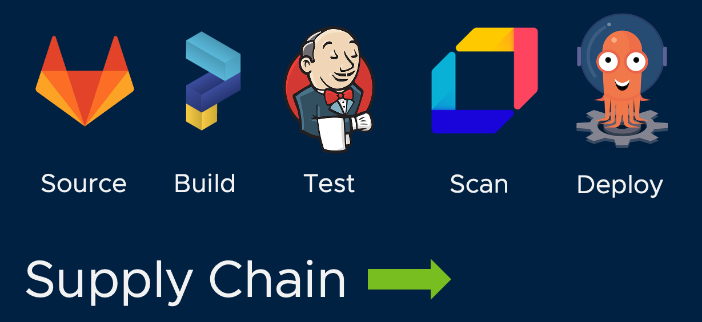
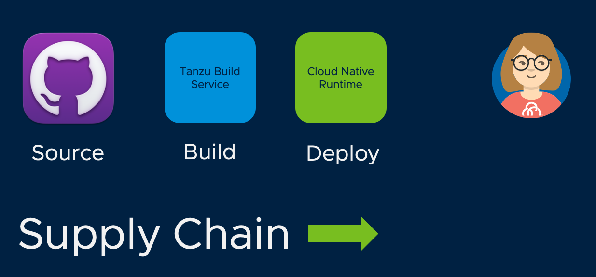

## Supply Chains

Alana works with Tanzu Application Platform by defining a **supply chain**. A supply chain defines a specific sequence of processing and tooling that defines the path to production that meets the governance standards at Alana's company:



This is Alana's supply chain, and she is free to customize it as she pleases: adding, removing, and swapping out components. This supply chain defines an automated, repeatable path to production for all applications being deployed to her clusters. Alana can define multiple supply chains to be used for different use cases.

For this demo, we are going to use a simplified supply chain, which retrieves application source from Git, creates a container image using Tanzu Build Service, and deploys it using Cloud Native Runtime.



The supply chain is managed by the **Supply Chain Choreographer (SCC)** component of Tanzu Application Platform. Supply Chain Choreographer is purpose built for managing the complete software supply chain cycle, from initial development through deployment to Kubernetes. A compliment to existing CI and CD tools (though it can certainly be used for that purpose), Supply Chain Choreographer is designed to coordinate across all tools involved in sourcing, building, testing, verifying, and deploying a software project.

To explore our supply chain, let's take a look at the supply chain definition we are using for "web" applications:

```editor:open-file
file: supplychain/supplychain.yaml
```
There are a few things to highlight in this file.

1. The ```spec/app.tanzu.vmware.com/workload-type``` entry defines that tag that will be used in the workload.yaml file of any application that utilizes this supply chain.
2. The ```components``` section has a sequential list of all components used by the supply chain.

To understand what each component does, you can take a look at the supplychain-tempates.yaml file:

```editor:open-file
file: supplychain/supplychain-templates.yaml
```

This file contains the definition of each supply chain resource. For example, the first resource is named ```git-repository-battery``` and leverages Flux to monitor and act on changes to our git repository. Similarly, ```kpack-battery``` utilizes kpack in conjunction with TBS to build and package the image. And ```app-deploy``` uses Tanzu Cloud Native Runtime to perform a Knative deployment of our application.

# Monitoring Supply Chain Execution

The logs in the bottom terminal window show the progress of supply chain execution. When the build is complete, the container images are stored in a Harbor registry, from which deployment operations will pull those images. Let's now look at how TAP automates the deployment and execution of our application.