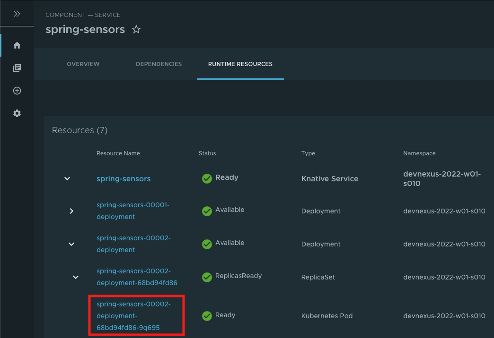

At this point, our onboarding developer needs to verify that their application was packaged and deployed.  We will verify the image digests from kpack and the image registry match using the Carvel `imgpkg` tool.  We will then use the Tanzu CLI to verify that the workloads are deployed and running.  We will also leverage Tanzu's powerful App Live View dashboard to verify ongoing operations.

## Verify Packaging

The workload image is pushed to a container registry once the supply chain completes building and packaging our Spring Sensors application.

Let's use the `imgpkg` tool to list out the tags and digests for our image in the container registry:
```execute
imgpkg tag list --digests -i harbor.{{ ingress_domain }}/tap/supply-chain/spring-sensors-{{ session_namespace }}
```

The resulting output is a listing of any images built for the spring-sensors application.  To verify the deployed image, we will execute the following command and compare the sha256 value for the latest image to the sha256 values in the output of the previous command:

```execute
kp image list
```

## Verify Deployment

We can use the Tanzu CLI to verify that the workload has made it through the supply chain:

```execute
tanzu apps workload list
```

Once the status shows **Ready**, let's see how to access our application.

```execute
tanzu apps workload get spring-sensors
```

This command provides details on our application, including the URL associated with the Knative Serving (part of Cloud Native Runtimes for VMware Tanzu) Service that provides Ingress to our application.  Click on the URL in the terminal window to open our application in a browser window.

## Monitor Operations

Cody can now use the Tanzu Application Platform GUI to get more information about his deployed workloads.  Click the URL below to access the TAP GUI:
```dashboard:open-url
name: Live
url: https://tap-gui.{{ ingress_domain }}
```

The TAP GUI provides a great deal of information about running software deployed through TAP.  Cody is particularly interested in the App Live View.  It provides real-time visibility into his new application.  To get to the App Live View, navigate to the Runtime Resources associated with the Spring Sensors application by clicking the follwing URL:

```dashboard:open-url
url: https://tap-gui.{{ ingress_domain }}/catalog/default/component/spring-sensors/workloads
```

In the resulting view, look for an entry in the list with a Resource Name of "spring-sensors", and a namespace of "{{ session_namespace }}".  Click the rightward caret icon to the left of that entry to list out the deployments for your application.

You will likely see multiple deployments. Click the rightward caret icon to the left of the entry that has the largest number in the "spring-sensors-NNNNN-deployment" name (where NNNNN is a number).

Finally, click the rightward caret icon next to the ReplicaSet that appears under the deployment you just expanded.  You should now see a Kubernetes Pod that represents your currently running application.

The view should look something like the following image:


Click on the resource name for the Kubernetes Pod.  In the image above, that entry is highlighed with a red box.

Scrolling down in the resulting view will be show a section titled "Live View" that includes the App Live View capabilities.  Use the drop-down menu on the App Live View pane to explore application details, health information, logging levels, metrics and other details about the running application.  

The information in the App Live View is surfaced for projects utilizing [Spring Boot's Actuators](https://docs.spring.io/spring-boot/docs/current/reference/html/actuator.html) or [Steeltoe's Management endpoints](https://steeltoe.io/cloud-management).  These endpoints are automatically configured by the supply chain to only be accessible from the TAP GUI, so Cody doesn't have to remember to protect access to those endpoints.

Click on the top pod row.  On the subsequent screen, you can use the "Information Category" drop-down to navigate through detailed troubleshooting data on the Spring Sensors app.