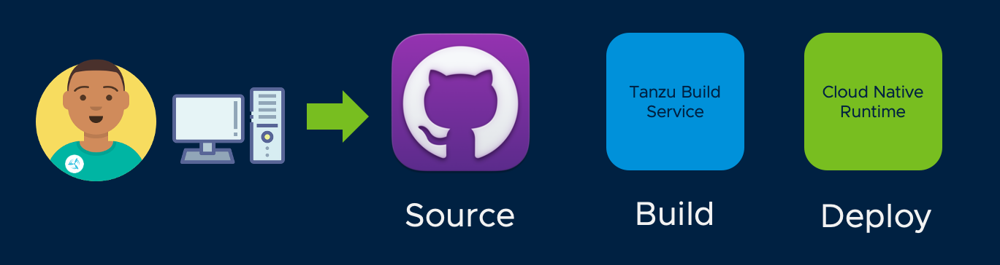

## Iteration

So Cody now has a running deployment, and it conforms to the compliance standards that Alana defined. But Cody's just getting started. The supply chain is repeatable, so each new commit that Cody makes to the codebase will trigger another execution of the supply chain.



Let's make a code change

```editor:open-file
file: spring-sensors/src/main/java/org/tanzu/demo/DemoController.java
```

Now, let's commit the change to the Git repo that is being monitored by our supply chain:

```execute
git -C ~/spring-sensors commit -a -m "Application Change"
```

```execute
git -C ~/spring-sensors push -u origin main
```

The supply chain will kick off. Let's see what's happening with the Knative service that is being managed by Cloud Native Runtime:

```execute
kn service list
```
