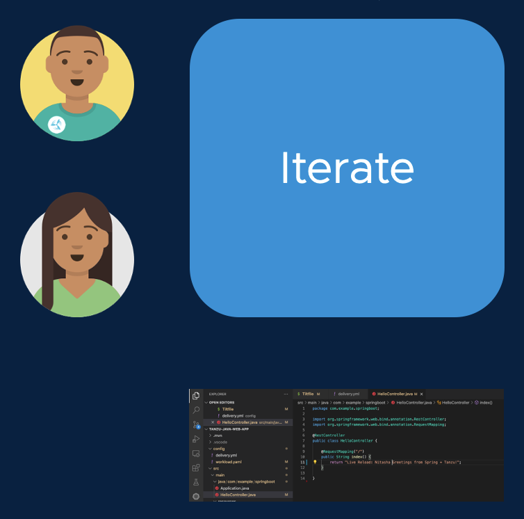

Cody the developer has been performing his development activities while logged into a Kubernetes cluster, which we call an Iterate cluster. This cluster is running Tanzu Application Platform software that enables the activities we've seen so far, like deploying the app container, performing Live Updates from the IDE, and surfacing the Live View data that we viewed in TAP GUI.

The Iterate cluster is a multitenant cluster, where Cody and his coworkers can log in and perform development activities. Each developer has permissions to deploy in their own developer namespace, so team members are safely isolated from each other while working concurrently.



The Iterate cluster is the only Kubernetes cluster where the developers need credentials or access. When Cody is ready to schedule a build, he simply needs to commit his changes to Git. As we will see, there are other clusters that will handle build, promotion, and deployment. Let's go ahead and commit changes to the Spring Sensors application we've been writing.

```execute
git -C /home/eduk8s/spring-sensors add .
```

```execute
git -C /home/eduk8s/spring-sensors commit -a -m "Initial Commit of Spring Sensors"
```

```execute
git -C /home/eduk8s/spring-sensors push -u origin main
```

Now, let's go check in with the Operations team to see how the build is automated.

Click on the button labelled "Workload" to continue to the next section of the workshop.
