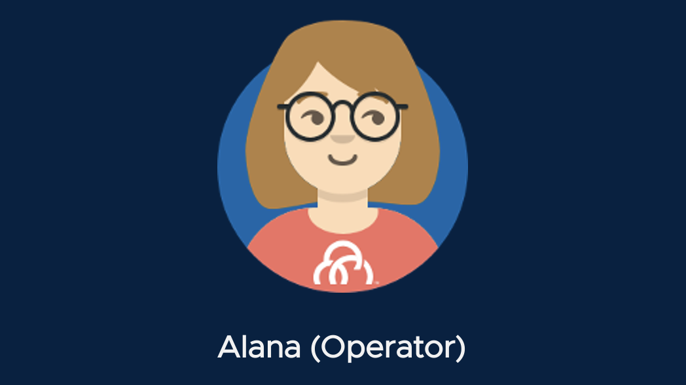
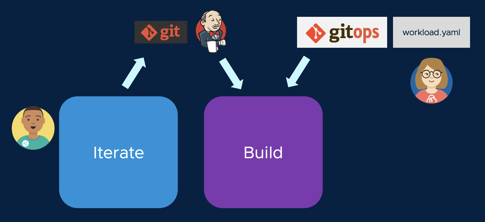

Cody the developer has committed his application source code to Git. Now, he will need to ask his DevOps team to automate build and deployment activity. We turn to Alana, who is operating Tanzu Application Platform.



Alana manages another Kubernetes cluster known as the Build cluster. This is a centralized environment where container images are built, security scans are applied, and deployment conventions are enforced for target environments, such as QA/Staging/Prod, where the application will run.

To begin scheduling builds for Cody's application, Alana will create a **Workload** resource on the Build cluster. The Workload watches the repo where Cody's application lives, and identifies the rules that will be used to build and deploy that applcation. Let's look at the Workload resource that Alana will create.

```editor:open-file
file: /home/eduk8s/gitops-workloads/workload-{{ session_namespace }}.yaml
```

This file isn't complex, but it's very important, so let's examine it in detail.

```editor:select-matching-text
file: /home/eduk8s/gitops-workloads/workload-{{ session_namespace }}.yaml
text: "workload-type"
before: 0
after: 0
```

The **workload-type** label identifies the secure **supply chain** that will be used to deliver Cody's application. What's a supply chain? We'll take a look in the next section.

```editor:select-matching-text
file: /home/eduk8s/gitops-workloads/workload-{{ session_namespace }}.yaml
text: "part-of"
before: 0
after: 0
```

The **part-of** label is used by TAP GUI to identify the application. TAP GUI is built on the open source project Backstage, which groups applications into **Components**. This label tells TAP GUI to make all the information about Cody's application visible in the spring-sensors Component.

```editor:select-matching-text
file: /home/eduk8s/gitops-workloads/workload-{{ session_namespace }}.yaml
text: "url:"
before: 0
after: 0
```

This URL identifies where the source code for Cody's application lives. The Build Server will watch for updates to the source repo, and schedule new builds when commits come in.

But what if Alana already has a CI tool, like Jenkins or Azure DevOps, that is compiling source code and running tests? No problem! Instead of pointing to source, we can point the Workload at the repository where the compiled artifacts are stored by the CI pipeline.

```editor:select-matching-text
file: /home/eduk8s/gitops-workloads/workload-{{ session_namespace }}.yaml
text: "minScale"
before: 0
after: 0
```

In the Workload, we can put additional specifiers on the runtime behavior of the deployment. For example, here we are telling the autoscaler to always have at least one instance of this web app's container running at all times, so that it can quickly respond to new requests.

Alana the operator is ready to create the workload resource, but she is not going to log directly into the Build cluster to do so. Instead, she is going to use a **GitOps** approach. She is going to add the workload definition to a Git Repo where all of the Build cluster's workloads are stored, and then Tanzu Application Platform will synchronize that repo with the Build cluster. Alana loves this approach because it limits privileged access to the Build environment, allows her to see at a glance which Workloads are being managed by the Build cluster, and provides auditing history of the Build cluster's behavior. If a third party wants to add a Workload to the Build cluster, they can simply submit it as a pull request to the GitOps repository, for Alana to review and approve.

So let's review. Cody performed his development activities on the Iterate cluster, and committed his source code to Git. Alana created a **Workload** definition in a GitOps repository, which instructed the Build server to begin processing Cody's source code (or, the artifacts from the CI pipeline that processed Cody's source code).



Execute the following commands to commit the Workload definition to the GitOps repository:

```execute
git -C /home/eduk8s/gitops-workloads add workload-{{ session_namespace }}.yaml
```

```execute
git -C /home/eduk8s/gitops-workloads commit -a -m "Adding workload for {{ session_namespace }}"
```

```execute
git -C /home/eduk8s/gitops-workloads pull -r
```

```execute
git -C /home/eduk8s/gitops-workloads push -u origin main
```

Now, we'll see what the Build cluster does.

