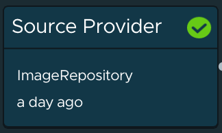
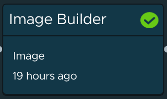
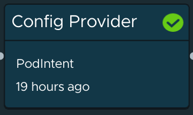
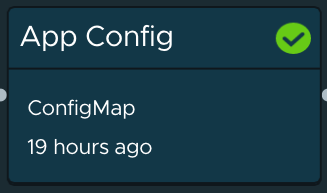
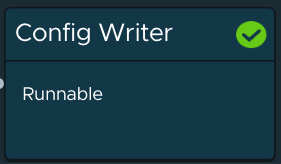

Tanzu Application Platform deploys an important software component onto the Build cluster called **Supply Chain Choreographer**. Supply Chain Choreographer is built on the open-source project Cartographer (https://cartographer.sh), and it allows operation teams to author secure software supply chains, and impose governance on the path to production.

Alana the operator, in consultation with other stakeholders like Enterprise Architecture and Security, will declare her company's approved process for container builds, deployment specifications, and security scanning, and this process will be dynamically applied to each new workload that is deployed onto the build server.

When we created the Workload definition for our application (through the GitOps repo), Supply Chain Choreographer created a new supply chain for us (it may take 30 seconds or so to show up). Let's take a look:

```dashboard:open-url
url: https://tap-gui.{{ ENV_VIEW_CLUSTER_DOMAIN }}/supply-chain/build-cluster/default/spring-sensors-{{ session_namespace }}
```

It may take up to 60 seconds from the time we committed the workload, until the time the supply chain is created on the Build cluster. If the screen for the supply chain is empty, wait a few seconds and then refresh.

This is a relatively simply supply chain, that is simpler to follow. Each stage in the supply chain independently determines when its source inputs have changed, and whether it needs to take reconciliation steps to ensure that the application deployment is compliant.



The supply chain begins at the source provider step, where it will be monitoring the Git source code repo that was specified in the workload. It will supply the application source to subsequent steps in the supply chain, and continuously monitor for subsequent updates (commits) to the source.



The Image Builder step is responsible for producing the container image runtime for the application. The default implementation of Image Builder uses **Tanzu Build Service**. We saw how Tanzu Build Service simplified container creation for Cody the developer during iterative development, but it is especially powerful when used in a Supply Chain. Tanzu Application platform continually publishes security fixes and version updates for the buildpacks and OS images used for container creation, and it can automatically trigger patching and rebuilds of the container images without any intervention from developers or operators.



The Config Provider step uses a Tanzu Application Platform component called **Convention Service**. Convention Service allows you to specify customizations to Kubernetes resources that will automatically be enforced on every workload that runs through the supply chain. The number of customizations you can apply is endless, but examples include:
* Embedding a container sidecar in the application pod, to implement required capabilities like antivirus scanning or log export to Splunk
* Attaching an expense code label to the deployment resource, to cost tracking and chargeback
* Budgeting memory and CPU for the deployment



The App Config step will output a complete specification of the Kubernetes resources needed to deploy the application onto a target cluster. The default implementation uses a Knative service for deployment, which simplifies zero-downtime updates and autoscaling. The resources generated here will include the reference to the container image produced by **Tanzu Build Service**, and the customizations provided by **Convention Service**



The final step of the supply chain is to output the deployment specification to a GitOps repo, to easily manage promotion to environments like QA, Staging, and Production.
