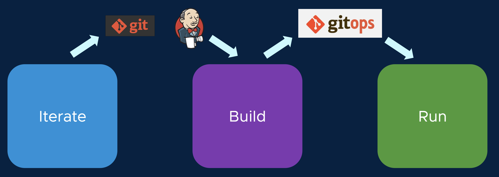

We now have a complete deployment specification for our application written to a GitOps repo, and that specification has been generated and vetted by our secure software supply chain. Alana the operator know that the specification is safe to deploy, and she can verify that it is compliant with her company's governance policies.

The Kubernetes clusters where our application will ultimately run are known as Run clusters. Whereas our application was developed on a single Iterate cluster, and it was built on a single Build cluster, there may be numerous Run clusters where the application is deployed. For example, the application may be promoted to QA, Staging, and ultimately Production, and each of these environments will have their own Run cluster.

The role of the Run cluster is to simply read the deployment specification that was written to the GitOps repo, and apply these resources to Kubernetes (plus any environment-specific resources, like configuration).



Just as we created a **Workload** resource on the Build cluster to generate the supply chain for our application, we will create a **Deliverable** resource on the Run cluster, to instruct the Run cluster to sync with our GitOps repo. Let's preview the Deliverable:

```editor:open-file
file: /home/eduk8s/gitops-deliverables/deliverable-{{ session_namespace }}.yaml
```

The deliverables are simple, they just contain identifiers for the application, and a reference to the same GitOps repo where they supply chain outputted to.

You know the drill by now: Alana isn't going to log directly into the Run clusters to create the deliverable. She will write the Deliverable to a GitOps repo, which will be synced to the Run cluster. Nobody ever has to directly access a sensitive environment like Production to enable a deployment!

Execute the following commands to commit the Workload definition to the GitOps repository:

```execute
git -C /home/eduk8s/gitops-deliverables add deliverable-{{ session_namespace }}.yaml
```

```execute
git -C /home/eduk8s/gitops-deliverable commit -a -m "Adding deliverable for {{ session_namespace }}"
```

```execute
git -C /home/eduk8s/gitops-deliverable pull -r
```

```execute
git -C /home/eduk8s/gitops-deliverables push -u origin main
```
