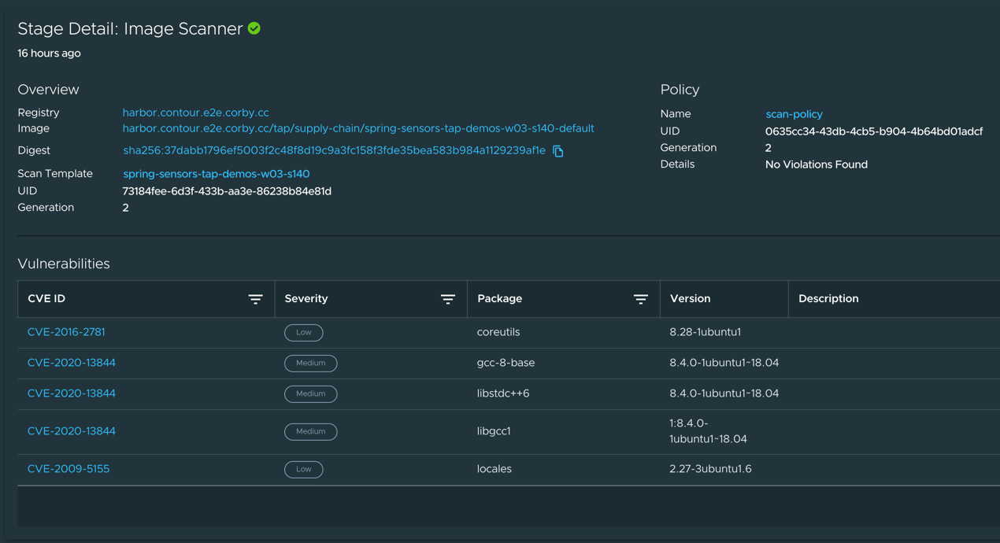
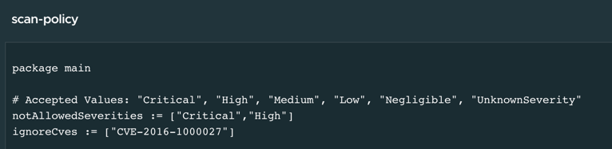
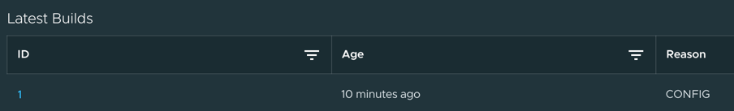
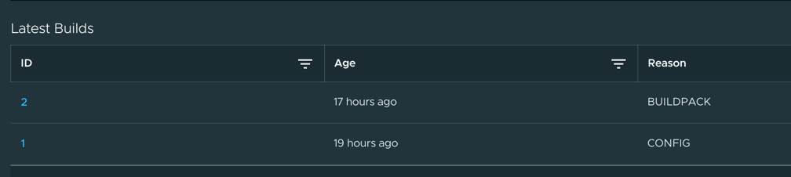

We've seen an application progress through the supply chain, but the supply chain hasn't stopped working! Let's take a closer look at why Tanzu Application Platform's Supply Chain Choreographer gives Alana, the operator, ongoing peace of mind.

Each stage of the supply chain is running an ongoing reconciliation, ensuring that the governance process it is responsible for (e.g. container build, security scan, convention definition) remains compliant, and takes corrective action when necessary. This is the difference between our **Choreography** approach, and the **Orchestration** approach used by traditional pipelines.

Let's look at an example. Click on the **Image Scanner** box in our supply chain. At the bottom of the screen, you will see Stage Detail Information.



Here we can scroll through all the CVEs that were detected by the image scanner. Clicking on the CVE hyperlink in the first column will allow us to review detailed, published information about the CVE.

In this case, the image scanner found a number of Low and Medium CVEs, but no policy violations that would prevent the container image from being published. How did the scanner make that determination? It used the scan policy that Alana defined! Click on the _scan-policy_ hyperlink in the upper right of the Stage Detail:



There are several functions that implement the pattern matching logic, but we are most interested in the constants at the top that Alana can easily override. **notAllowedSeverities** contains Critical and High, meaning any severities found at these levels will prevent progress through the supply chain.

There is an exception, though! Alana consulted with her CISO team, and got an exemption for CVE-2016-1000027, a CVE with no published fix, and which only affects fringe cases not applicable to Alana's applications. Adding it to **ignoreCves** tells the image scanner to let an image progress through the supply chain, even if this CVE is detected.

The Image Scanner is continuing to run, independently of other stages in the supply chain. This means that if Alana makes an update to the scan policy, it will be immediately applied to all workloads that have been submitted to the supply chain, without the need to re-execute previous stages.

Click on the **Image Builder** box in the Supply Chain. In the Stage Detail, you will see something like this:



A single container build has occurred, and the reason given is CONFIG, meaning that we received updated source code from the previous stage in the supply chain, which triggered the build. But let's look at the Stage Detail from a different workload that was submitted a little while ago:



Here, we see that a second build occurred a couple of hours after the first one, and the reason given is BUILDPACK. Tanzu Application Platform continually publishes security fixes and version updates for the buildpacks and OS images used for container creation. Alana elects to automatically ingest these updates, and makes them available to the Image Builder. The Image Builder is able to immediately trigger rebuilds of images that are affected by the updates, and progrss them through the supply chain, without waiting on earlier stages. Image Builder ensures that all workload containers are being continually patched and updated, without any manual intervention required from Cody or Alana!

Security teams may want to view the posture of the whole application portfolio, and not just individual applications. Tanzu Application Platform provides a security dashboard that provides an expansive view, with the ability to navigate to specific workloads:

```dashboard:open-url
url: https://tap-gui.{{ ENV_VIEW_CLUSTER_DOMAIN }}/security-analysis
```
