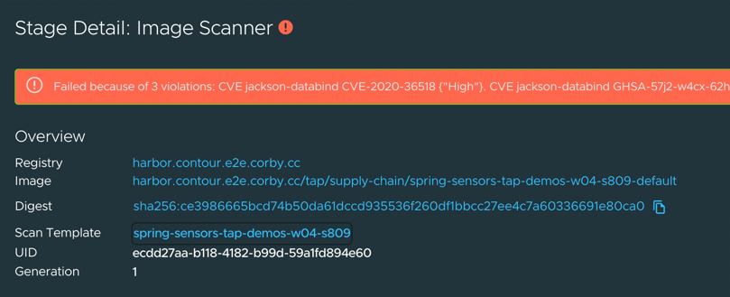
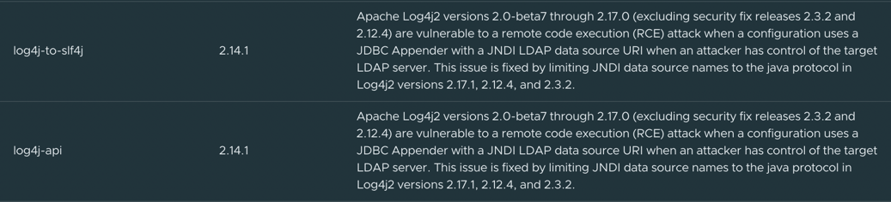

Cody's a fantastic developer, and he's usually good about following SecOps policies. But hey, we all have days where we take shortcuts. Let's see what happens if carelessness introduces a security risk into our software supply chain.

Let's look at the pom.xml file in Cody's application. In a Java product, this describes the external software dependencies that will be packaged with our application.

```editor:select-matching-text
file: spring-sensors/pom.xml
text: "<version(.*)version>"
isRegex: true"
```

Cody is using a current version of Spring Boot, a Java microservice framework in his application. But let's simulate what would happen if Cody reused an older pom.xml file, with references to an out-of-date version of Spring Boot.

```editor:replace-text-selection
file: spring-sensors/pom.xml
text: "<version>2.6.0</version>"
```

This will cause Cody's application to package a version of Spring Boot from last year, with unpatched security holes. Is our software supply chain doomed? Let's commit the changes:

```execute
git -C /home/eduk8s/spring-sensors commit -a -m "Initial Commit of Spring Sensors"
```

```execute
git -C /home/eduk8s/spring-sensors push -u origin main
```

Now, we'll need to wait a few minutes. Our supply chain will notice that a new commit was made, and will begin packaging the updated application. It will create the container image, and pass it off to the Image Scanner. We can follow along the progress here:

```dashboard:open-url
url: https://tap-gui.{{ ENV_VIEW_CLUSTER_DOMAIN }}/supply-chain/build-cluster/default/spring-sensors-{{ session_namespace }}
```

Eventually, the green checkmark will disappear from the Image Scanner, and we will see that the supply chain stops progressing. Click on the Image Scanner box to find out why:



The image scanner found **high** and **critical** CVEs that violated our scan policy, and so progress in the supply chain was halted before the application could be deployed. A closer look at the vulnerability list shows that the CVEs include the dreaded [Log4Shell](https://en.wikipedia.org/wiki/Log4Shell) vulnerability that allows arbitrary code execution.



Crisis averted!