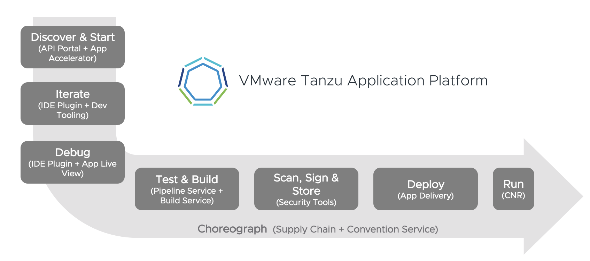

# Tanzu Application Platform Live Demonstration
**Note:** Some of the features of this demonstration will have trouble in the Safari browser.  We recommend you switch to a browser like Edge, Firefox, or Chrome for the smoothest experience.

**Tanzu Application Platform (TAP)** delivers a **developer experience** atop Kubernetes. Operators are able to customize and deploy an **application-aware platform**, instead of requiring developers to write platform-aware applications. Tanzu Application Platform abstracts away  the individual components in the DevSecOps toolchain that is leveraged in building, testing, verifying, deploying, and operating applications. This new experience is accomplished through the addition of enhanced developer tooling, supply chain automation, and coordination of work/separation of concerns between developers, architects, security teams, and operators. Tanzu Application Platform runs on any API-compatible Kubernetes distribution.

This demonstration is intended to walk the audience through how development teams and operators will interact with the platform to enable iterative development cycles, and secure, automated delivery to production.
