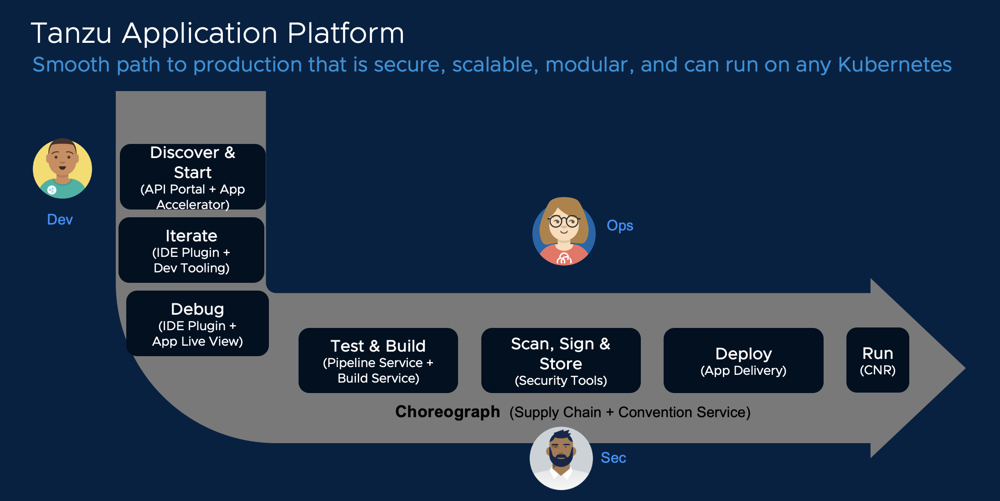

# Tanzu Application Platform Live Demonstration

_We recommend you use Chrome, Edge, or Firefox browsers in this workshop for the smoothest experience._

**Tanzu Application Platform (TAP)** enables enterprises to deliver a **developer experience** atop Kubernetes. Operators are able to customize and deploy an **application-aware platform**, instead of requiring developers to write platform-aware applications. 

Tanzu Application Platform abstracts away the mechanics of container orchestration, secure software supply chains, and GitOps deployment/promotion models. It allows developers to focus purely on the authoring of business logic, user interfaces, and APIs. Meanwhile, the operations teams can declare compliant delivery processes that will be implemented, in a consistent, automated, repeatable manner to each new application workload that is onboarded.

This demonstration will show how development teams and operators will interact with the platform to enable iterative development cycles, and secure, automated delivery to production.

You can always progress to the next part of the workshop by clicking the blue button in the right corner below. Click on the button labelled "Learning Center" to get started.